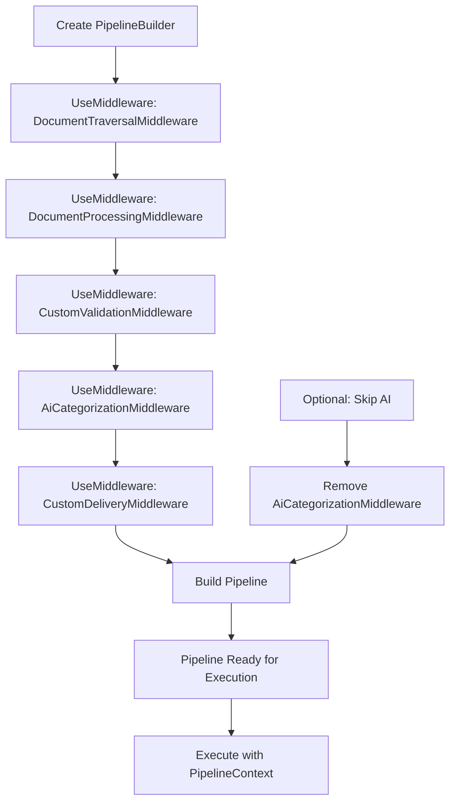

# DocIngest

DocIngest is a flexible, modular .NET library designed for automated document ingestion, processing, and delivery. It transforms unstructured documents from various sources—such as drop locations, scanned images, PDFs, and other files—into structured, metadata-enriched outputs. Leveraging AI for intelligent categorization, it enables seamless deployment to systems like CRM (Customer Relationship Management) or DMS (Document Management Systems), relating documents to the appropriate entities based on extracted insights.

## Core Idea

The fundamental concept behind DocIngest is to streamline document workflows in enterprise environments. Imagine a scenario where documents arrive in a designated "drop location" (e.g., a network folder with subfolders representing individual documents). These could include:

- Scanned images (multi-page invoices or contracts)
- PDFs, Word documents, or text files
- Mixed file types within a single logical document

DocIngest processes these inputs by:

1. **Traversal**: Scanning the drop location and grouping files into logical documents.
2. **Processing**: Extracting text via OCR for images, combining multi-page documents, and generating unified outputs (e.g., Word or PDF files).
3. **AI Categorization**: Using AI to analyze text and assign categories, tags, and insights (e.g., "Invoice", "Vendor: ABC Corp", "Amount: $500").
4. **Delivery**: Organizing and delivering processed documents to destinations like local folders, CRM systems, or DMS platforms, ensuring they relate to the correct entities (e.g., customer records or project folders).

This pipeline reduces manual effort, minimizes errors, and enables intelligent routing—perfect for automating document-heavy processes in finance, legal, or administrative domains.


## Getting Started

### Prerequisites

- .NET 10.0 SDK
- Tesseract OCR (download from [GitHub](https://github.com/UB-Mannheim/tesseract/wiki))
- Optional: OpenAI API key for AI categorization

### Installation

Install the NuGet package: `Install-Package DocIngest.Core`

For samples, clone the repository and navigate to the sample folder.

### Quick Start

Run the InvoiceOrganizer sample: Place invoice files in `input/invoices/`, run `dotnet run` in [samples/InvoiceOrganizer/](samples/InvoiceOrganizer/), view organized output in `output/`.

## Sample Application

The InvoiceOrganizer sample demonstrates organizing invoices by date. It processes subfolders in `input/invoices/` as logical documents, extracts text via OCR, combines multi-page files, parses dates, and delivers organized outputs to `output/` (e.g., 2023/01/). See [samples/InvoiceOrganizer/Program.cs](samples/InvoiceOrganizer/Program.cs) and [samples/InvoiceOrganizer/appsettings.json](samples/InvoiceOrganizer/appsettings.json) for implementation.

## Flexibility and Extensibility

DocIngest's architecture emphasizes flexibility, allowing you to adapt it to diverse workflows without rewriting core logic. Built on a pipeline pattern with dependency injection (DI), it supports:

The following Mermaid diagram illustrates how you can build custom pipelines by chaining middlewares using the `PipelineBuilder`:



This diagram shows the modular nature of the pipeline, where middlewares can be added, removed, or reordered to suit specific needs. For example, you can skip AI categorization for simple workflows or insert custom middlewares for validation, encryption, or domain-specific logic.

- **Service Replacement**: Core services are defined by interfaces, enabling easy swaps. For example:
  - Replace the OCR service (default: Tesseract) with Azure Computer Vision or Google Cloud Vision.
  - Swap the document generator (default: DocX/PDFsharp) for custom formats or integrations.
  - Change the delivery service to push to CRM APIs, DMS systems, or cloud storage (e.g., Azure Blob Storage).

- **Custom Middleware**: The pipeline is composed of middlewares implementing `IPipelineMiddleware`. Add, remove, or reorder steps for custom logic:
  - Insert validation middleware to check document integrity.
  - Add encryption or watermarking for security.
  - Implement custom AI prompts for domain-specific categorization (e.g., legal clauses).

- **Pipeline Customization**: Use `PipelineBuilder` to completely redefine the pipeline. For instance, skip AI categorization for simple workflows or add parallel processing for high-volume scenarios.

- **Configuration and Context**: Runtime settings (e.g., output formats, organization criteria) are configurable via `PipelineContext`. This shared dictionary allows middlewares to communicate and customize behavior dynamically.

This modularity ensures DocIngest scales from simple file organization to complex, AI-driven enterprise integrations.

## NuGet Package Support

DocIngest is distributed as a NuGet package (`DocIngest.Core`, version 1.0.0), making it easy to integrate into .NET projects. Key features:

- **Dependencies**: Includes essential libraries like Microsoft.Extensions.AI for AI integration, Tesseract for OCR, DocX/itext7/PDFsharp for document generation, and SixLabors.ImageSharp for image handling.
- **Target Framework**: Built for .NET 10.0, leveraging modern C# features (nullable references, implicit usings).
- **Symbols and Debugging**: Includes symbol packages (.snupkg) for enhanced debugging in IDEs like Visual Studio.
- **Installation**: Add via NuGet Package Manager: `Install-Package DocIngest.Core`.

The package supports both development and production use, with tests (xUnit, Moq) ensuring reliability. Samples are included in the repository for hands-on learning.

## Usage Examples

### Basic Pipeline Setup

```csharp
using DocIngest.Core;

// Configure services
var ocrService = new TesseractOcrService();
var documentGenerator = new DefaultDocumentGenerator();
var deliveryService = new FolderDeliveryService();

// Build pipeline (without AI for simplicity)
var pipeline = new PipelineBuilder()
    .UseMiddleware(new DocumentTraversalMiddleware())
    .UseMiddleware(new DocumentProcessingMiddleware(ocrService, documentGenerator))
    .UseMiddleware(new DateParsingMiddleware())
    .UseMiddleware(new DeliveryMiddleware(deliveryService))
    .Build();

// Execute
var context = new PipelineContext
{
    ["InputPath"] = "input/documents",
    ["OutputPath"] = "output",
    ["OrganizationPathFunc"] = (Func<OutputDocument, string>)(doc =>
        doc.Tags.FirstOrDefault(t => t.StartsWith("date/"))?.Replace("date/", "") ?? "unknown")
};

await pipeline(context);
```

### Custom Middleware Example

Implement a custom middleware for document validation:

```csharp
public class ValidationMiddleware : IPipelineMiddleware
{
    public async Task InvokeAsync(PipelineContext context, PipelineDelegate next)
    {
        var documents = context.Get<List<Document>>("Documents");
        foreach (var doc in documents)
        {
            if (doc.Files.Count == 0)
                throw new InvalidOperationException("Document has no files.");
        }
        await next(context);
    }
}

// Add to pipeline
var pipeline = new PipelineBuilder()
    .UseMiddleware(new ValidationMiddleware())
    // ... other middlewares
    .Build();
```

### Replacing a Service

Swap the OCR service for a custom implementation:

```csharp
public class CustomOcrService : IOcrService
{
    public async Task<string> ExtractTextAsync(byte[] imageBytes)
    {
        // Custom OCR logic, e.g., call Azure AI
        return "Extracted text...";
    }
}

// Inject custom service
var ocrService = new CustomOcrService();
// Use in DocumentProcessingMiddleware
```

### Running the Sample Pipeline

Based on InvoiceOrganizer, configure services and run:

```csharp
// Configure services (simplified from sample's DI)
var ocrService = new TesseractOcrService();
var documentGenerator = new DefaultDocumentGenerator();
var deliveryService = new FolderDeliveryService();

// Build pipeline
var pipeline = new PipelineBuilder()
    .UseMiddleware(new DocumentTraversalMiddleware())
    .UseMiddleware(new DocumentProcessingMiddleware(ocrService, documentGenerator))
    .UseMiddleware(new DateParsingMiddleware())
    .UseMiddleware(new DeliveryMiddleware(deliveryService))
    .Build();

// Execute (similar to sample)
var context = new PipelineContext
{
    ["InputPath"] = "input/invoices",
    ["OutputPath"] = "output",
    ["OrganizationPathFunc"] = (Func<OutputDocument, string>)(doc =>
        Path.Combine(doc.Tags.FirstOrDefault(t => t.StartsWith("date/"))?.Replace("date/", "") ?? "unknown", doc.Category))
};

await pipeline(context);
```

## Samples

The [samples/](samples/) folder provides example applications demonstrating DocIngest use cases. Clone the repository to explore and modify them.

### Invoice Organization

The InvoiceOrganizer sample processes invoices from a drop folder, using OCR to extract text, parsing dates for organization, and delivering to structured folders. It shows extensibility by allowing service swaps (e.g., replace Tesseract with Azure OCR) and middleware additions (e.g., custom date parsing). Run with `dotnet run` in [samples/InvoiceOrganizer/](samples/InvoiceOrganizer/).

### Future Samples

Planned samples include contract management (demonstrating AI categorization for legal clauses) and receipt aggregation (showing multi-page handling and custom organization by vendor/amount).

### Getting Started with Samples

After installing DocIngest.Core via NuGet, explore samples to understand integrations. Each sample includes setup instructions in its folder.

## Configuration

Configure DocIngest via `appsettings.json` or environment variables.

- **appsettings.json**: Set `ImageProcessing:OutputFormat` (e.g., "Word", "PDF").
- **Environment Variables**: `OPENAI_API_KEY` for AI features.
- **PipelineContext**: Use keys like `OrganizationPathFunc` for custom organization logic.

## Architecture Overview

- **Data Models**: `Document` (logical document), `OutputDocument` (processed file with metadata), `FileMetadata` (file details).
- **Pipeline**: Delegate-based chain of middlewares, executed in reverse order. `PipelineContext` is a shared dictionary for passing data (e.g., documents list, output paths) between middlewares.
- **Services**: Interfaces (`IOcrService`, `IDocumentGenerator`, `IDeliveryService`) for pluggability.
- **AI Integration**: Uses `IChatClient` for categorization prompts, returning JSON with category, tags, and insights.

## Building and Testing

- **Build**: Run `dotnet build` in the root or specific project folders.
- **Test**: Run `dotnet test` in [DocIngest.Tests/](DocIngest.Tests/) to execute unit tests.
- **Package**: Run `dotnet pack` to create NuGet packages.

## Contributing

Contributions are welcome! Extend middlewares, add services, or improve AI prompts. Add new samples for additional document types to expand use cases. Ensure tests pass and follow the modular design.

## Troubleshooting

- **Tesseract Not Found**: Ensure Tesseract is installed and in PATH.
- **AI API Errors**: Check `OPENAI_API_KEY` or AI client configuration.
- **Font Issues in Tests**: Install required fonts for PDF generation.
- Enable AI in samples by uncommenting `AiCategorizationMiddleware` and setting the API key.
